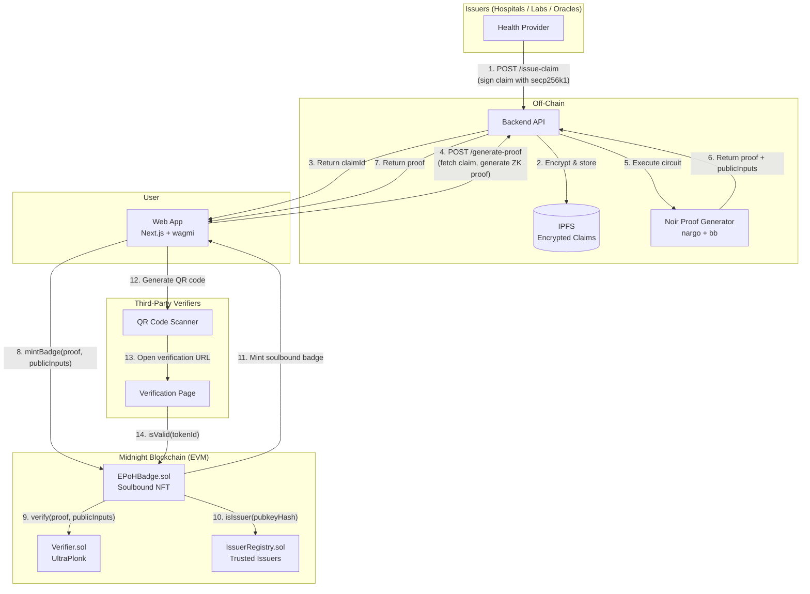

# E-PoH System Architecture

## High-Level Flow



## Component Details

### 1. Issuer Layer
- Health providers (hospitals, labs, oracles) with Ethereum wallets
- Sign health claims using standard secp256k1 ECDSA
- Authenticated via API keys to the backend
- Public key hashes registered in `IssuerRegistry`

### 2. Backend API (Fastify + TypeScript)
- `POST /issue-claim` — Issuer signs claim, encrypts with AES-256-GCM, stores on IPFS
- `POST /generate-proof` — Fetches encrypted claim, decrypts, generates Noir ZK proof
- `GET /verify/:badgeId` — Reads badge validity from chain
- Proof generation via `@noir-lang/noir_js` + `@aztec/bb.js` (or CLI fallback)

### 3. ZK Circuit (Noir + Barretenberg)
- **Proof system**: UltraPlonk (no trusted setup)
- **Inputs**: Signed health claim (private), claim metadata
- **Outputs**: claim_type, expires_at, subject_hash, issuer_pubkey_hash (public)
- **Constraints**: Signature validity, identity binding, expiry sanity, claim type range

### 4. Smart Contracts (Solidity on Midnight)
- **Verifier.sol**: Auto-generated UltraPlonk verifier
- **IssuerRegistry.sol**: Ownable whitelist of issuer pubkey hashes
- **EPoHBadge.sol**: ERC-721 soulbound token with:
  - Proof-gated minting
  - On-chain expiry checking (`block.timestamp`)
  - Transfer blocking (soulbound)

### 5. Frontend (Next.js + wagmi)
- Wallet connection (RainbowKit)
- Badge request + proof generation (Web Worker for WASM proving)
- Dashboard with active badges and expiry countdowns
- QR code generation for badge sharing

### 6. Verification Layer
- Public verification page (no wallet required)
- Reads `isValid(tokenId)` from chain
- Displays: valid/expired status, claim type, expiry time

## Data Flow Summary

```
Issuer signs claim (secp256k1)
        ↓
Encrypted claim stored on IPFS
        ↓
User requests proof generation
        ↓
Backend decrypts claim, runs Noir circuit
        ↓
ZK proof generated (private inputs hidden)
        ↓
User submits proof to EPoHBadge contract
        ↓
Contract verifies proof + checks issuer + checks expiry
        ↓
Soulbound badge minted (auto-expires via block.timestamp)
        ↓
Third parties verify via QR → on-chain isValid() call
```

## Privacy Guarantees

| Data | On-Chain Visibility |
|------|-------------------|
| Specific medical records | Never revealed |
| Subject's address | Hidden (only Poseidon2 hash) |
| Issuer's full public key | Hidden (only Poseidon2 hash) |
| Claim type (general category) | Public (by design — verifiers need this) |
| Expiry timestamp | Public (by design — enables time-based verification) |
| Proof of valid signature | Proven without revealing the signature |
