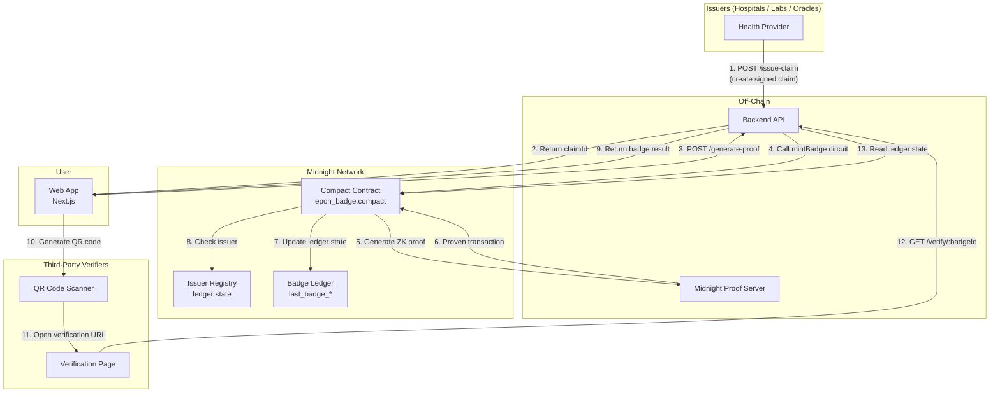

# E-PoH System Architecture

## High-Level Flow



## Component Details

### 1. Issuer Layer
- Health providers (hospitals, labs, oracles) with secret keys
- Identity proven via hash-based key derivation (persistentHash)
- No ECDSA signatures — issuer secret key is passed as a witness to the Compact circuit
- Public key hashes registered on the contract ledger

### 2. Backend API (Fastify + TypeScript)
- `POST /issue-claim` — Issuer creates a signed claim with their secret key
- `POST /generate-proof` — Calls the Compact circuit to mint a badge with ZK proof
- `GET /verify/:badgeId` — Reads badge validity from the Midnight ledger
- Uses `@midnight-ntwrk/wallet-sdk-*` for wallet management and transaction submission

### 3. Compact Contract (ZK Circuits + On-Chain State)
- **Language**: Compact 0.22 (Midnight's native DSL)
- **Proof system**: Midnight Proof Server (Docker, port 6300)
- **Key derivation**: `persistentHash<Vector<3, Bytes<32>>>([domain, sequence, sk])`
- **Issuer verification**: Arithmetic sum of boolean matches (avoids witness-value disclosure)
- **Circuits**: `addIssuer`, `mintBadge`, `revokeBadge`, `derivePublicKey`, `hashSubject`
- **Ledger state**: authority, issuer slots (0-3), badge data, counters

### 4. Midnight Network (Local Dev)
- **Node** (port 9944): Block production and transaction processing
- **Indexer** (port 8088): GraphQL API for ledger state queries
- **Proof Server** (port 6300): ZK proof generation from circuit transcripts
- **Network ID**: "undeployed" for local development

### 5. Frontend (Next.js)
- Badge request flow — delegates proof generation to backend/proof server
- Dashboard with active badges and expiry countdowns
- QR code generation for badge sharing
- No browser-side WASM proving needed

### 6. Verification Layer
- Public verification page (no wallet required)
- Reads badge state from the Midnight ledger via the indexer
- Displays: valid/expired/revoked status, claim type, expiry time

## Data Flow Summary

```
Issuer creates signed claim (secret key as witness)
        ↓
Backend stores claim, returns claimId
        ↓
User requests proof generation
        ↓
Backend calls Compact mintBadge circuit
        ↓
Proof server generates ZK proof
        ↓
Wallet SDK submits proven transaction to Midnight node
        ↓
Contract verifies issuer is registered (arithmetic check)
        ↓
Badge minted on ledger (soulbound, auto-expires)
        ↓
Third parties verify via QR → ledger state query
```

## Privacy Guarantees

| Data | On-Chain Visibility |
|------|-------------------|
| Specific medical records | Never revealed |
| Subject's address | Hidden (only persistentHash) |
| Issuer's secret key | Never revealed (witness only) |
| Which specific issuer signed | Hidden (arithmetic sum hides which slot matched) |
| Claim type (general category) | Public (by design — verifiers need this) |
| Expiry timestamp | Public (by design — enables time-based verification) |
| Proof of valid issuer | Proven without revealing the issuer's identity |
